# 🔐 Authentication & Security Architecture

## Overview

Luceron AI Backend implements **environment-isolated JWT authentication** to prevent cross-environment token reuse while providing comprehensive access control for services and agents.

## 🏗️ Architecture Components

### **Two-Layer Authentication System**


**Layer 1**: Services authenticate with RSA-signed JWTs using private keys  
**Layer 2**: OAuth endpoint issues environment-specific access tokens for API calls

### **Environment Isolation**


## 🔑 JWT Token Structure

### **Service JWT (Client Credentials)**
```json
{
  "iss": "qa_comprehensive_test_service",
  "sub": "qa_comprehensive_test_service", 
  "aud": "luceron-auth-server",
  "iat": 1640995200,
  "exp": 1640996100
}
```
*Signed with service's RSA private key*

### **Access Token (API Access)**
```json
{
  "iss": "luceron-qa-auth",        // Environment-specific issuer
  "sub": "qa_test_agent",          // Agent role for permissions
  "aud": "luceron-qa-api",         // Environment-specific audience  
  "environment": "QA",             // 🔑 Environment validation claim
  "service_id": "qa_test_service", // Which service requested token
  "iat": 1640995200,
  "exp": 1640999200
}
```
*Signed with environment-specific HMAC secret*

## 🛡️ Security Layers

### **1. Signature Validation**
- **QA tokens**: Signed with `QA_JWT_SECRET`
- **Production tokens**: Signed with `PROD_JWT_SECRET`  
- Cross-environment tokens fail signature verification

### **2. Environment Claims**
- Explicit `environment` field in every token
- Server validates token environment matches container environment
- Prevents environment confusion attacks

### **3. Audience/Issuer Validation**
- **QA**: `luceron-qa-auth` → `luceron-qa-api`
- **Production**: `luceron-prod-auth` → `luceron-prod-api`
- Different trust boundaries per environment

### **4. Role-Based Permissions**
```yaml
qa_test_agent:
  environments: ["QA"]              # 🔒 QA-only restriction
  endpoints: ["*"]                  # Full testing access
  resources: ["*"]                  # All CRUD operations
  operations: ["READ", "INSERT", "UPDATE", "DELETE"]

communications_agent:
  environments: ["PROD", "QA"]      # Production service
  endpoints: ["/agent/db"]
  resources: ["cases", "communications"]
  operations: ["READ", "INSERT", "UPDATE"]
```

## 🔄 Authentication Flow

```mermaid
sequenceDiagram
    participant S as Service
    participant O as OAuth2 Endpoint  
    participant A as API Endpoint
    participant V as JWT Validator
    
    S->>O: POST /oauth2/token<br/>Service JWT (RSA signed)
    O->>O: Verify RSA signature<br/>Check service identity
    O->>S: Access Token (HMAC signed)<br/>environment: "QA"
    
    S->>A: API Request<br/>Bearer: <access_token>
    A->>V: Validate JWT
    V->>V: Check signature (QA secret)<br/>Validate environment<br/>Check permissions
    V->>A: ✅ Validated
    A->>S: API Response
```



## 🧪 Testing & QA

### **QA Test Agent**
- **Full Permissions**: Can test all endpoints and resources
- **Environment Restricted**: `"environments": ["QA"]` only
- **Wildcard Access**: `"endpoints": ["*"], "resources": ["*"]"`

### **Security Guarantees**
✅ QA tokens **cannot** access production APIs  
✅ QA agent has **full testing capabilities** in QA environment  
✅ **Multi-layer validation** prevents token tampering  
✅ **Environment segregation** enforced cryptographically  

## 🚀 Service Registration

### **Add New Service**
```bash
# Generate keypair and register service
python src/tools/provision_service.py --role communications_agent

# For QA testing service
python src/tools/provision_qa_test_service.py --output-private-key
```

### **Environment Variables**
```bash
# QA Environment
ENV=QA
QA_JWT_SECRET=your-qa-secret
DATABASE_URL=qa-database-url

# Production Environment  
ENV=PROD
PROD_JWT_SECRET=your-prod-secret
DATABASE_URL=prod-database-url
```

## 🔍 Security Validation

### **Test Environment Isolation**
```bash
# Verify security implementation
python src/tools/test_environment_isolation.py
```

### **Attack Resistance**
| Attack Vector | Protection | Status |
|---------------|------------|---------|
| **Token Tampering** | Different signing secrets | ✅ **BLOCKED** |
| **Algorithm Confusion** | Strict algorithm allowlist | ✅ **BLOCKED** |
| **Cross-Environment** | Environment claim validation | ✅ **BLOCKED** |
| **Replay Attacks** | Token expiration (15 min - 1 hour) | ✅ **MITIGATED** |
| **Service Key Compromise** | Individual service isolation | ✅ **CONTAINED** |

---

## 📚 Additional Resources

- **Service Permissions**: `src/config/service_permissions.py`
- **JWT Configuration**: `src/config/settings.py` 
- **Authentication Logic**: `src/utils/auth.py`
- **OAuth2 Endpoint**: `src/api/routes/oauth2.py`

*Last Updated: August 2025*